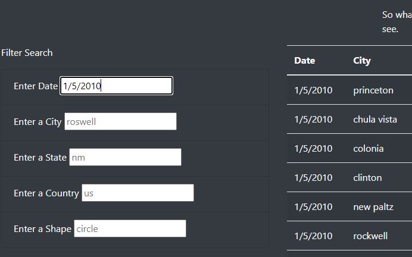
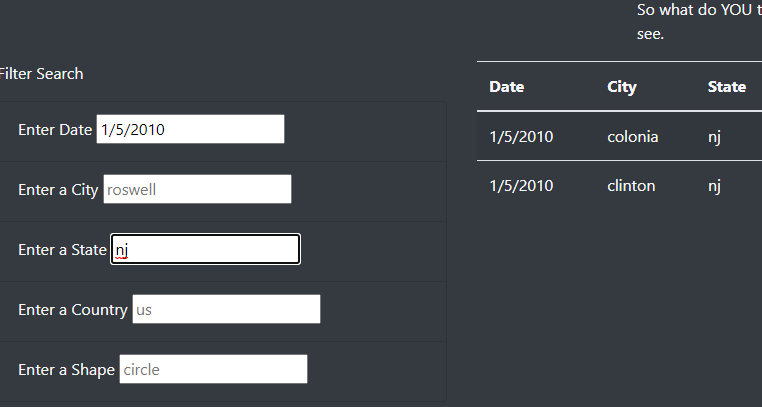
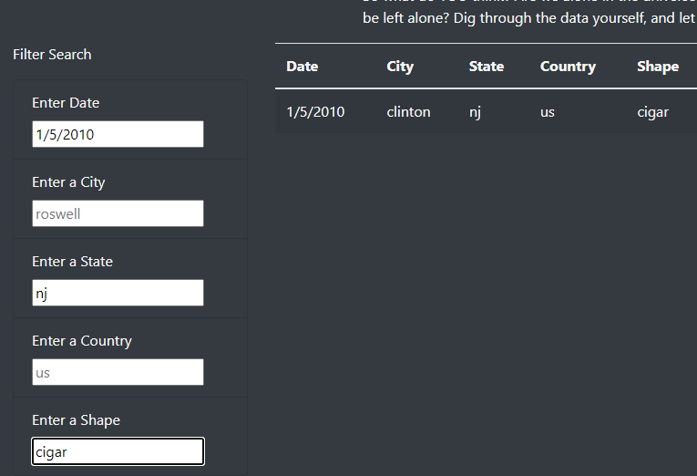

# UFO Sightings
## Purpose
The purpose of this project is to provide an easily accessible data set describing UFO sightings to anyone with Internet access.  In addition to providing easy access, this page also provides a simple way to filter by date, location, and type of sighting to make the large data set easier to use.

## Resources
- Source Data:  [UFO Data](./static/js/data.js)
- Tools Used:  Javascript ES6+, Bootstrap, D3, HTML

## Usage
The data on the page is very easy to filter.  Simply enter a date, location, and/or UFO shape into the provide text box, hit the enter key or move away from the box (MS Edge) and the table will automatically update.  Below are some examples.

To filter on date only, enter the date using the format show in the box (Month/Day/Year).  The year should be entered as 4-digits.  To the right of the filter you can see that the table has been updated to show only sightings from January 5, 2010

To filter on multiple criteria, update another filter item while leaving the existing filter(s) in place.  Below shows the addition of one more filter for state.  The table is updated to show sightings from New Jersey (nj) on January 5, 2010.

 

One more example that filters on date, state, and UFO shape.

 

## Recommendations for Improvement
There are a number of improvements that could be made to enhance the usability of this page:
- Provide a means to filter by partial date, such as by year, month, or day to allow users to find patterns in timing.
- Prior to filtering, convert all text to the same case (upper or lower) to eliminate the risk of a failed match due to differing case.
- Add summary information to help users decide where to start on their search.  For example, which countries, states, shapes, and date ranges are available.
- For the date filter, convert all dates to a common date/time format prior to filtering.  Similar to the case issue previously described, this will help minimize poor filter results due to differences in how users represent dates.